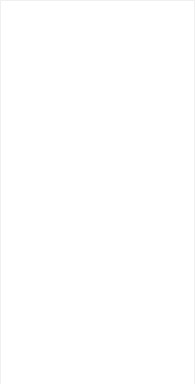

NetPractice is a general practical exercise to let you discover networking specifically on Subnetting.

## What is  an IP address
An IP address is simply an identifier for each device in a network, it is through it that the device can communicate with other devices, there are two different types.
- IPv4: Example of IPv4 -> 66.94.29.13
  - has a 32-bit address length.
  - It Supports Manual and DHCP address configuration.
  - In IPv4 end to end, connection integrity is Unachievable.
  - It can generate 4.29×109 address space.
  - The Security feature is dependent on application.
  - Address representation of IPv4 is in decimal.
  - Fragmentation performed by Sender and forwarding routers.
  - In IPv4 Packet flow identification is not available.
  - In IPv4 checksum field is available.
  - It has broadcast Message Transmission Scheme.
  - In IPv4 Encryption and Authentication facility not provided.
  - IPv4 has a header of 20-60 bytes.
  - IPv4 consist of 4 fields which are separated by dot (.) -> (---.---.---.---).
  - IPv4’s  IP addresses are divided into five different classes. Class A , Class B, Class C , Class D , Class E.
  - IPv4 supports VLSM(Variable Length subnet mask).
- IPv6: Example of IPv6 -> 2001:0000:3238:DFE1:0063:0000:0000:FEFB
  - IPv6 has a 128-bit address length.
  - It supports Auto and renumbering address configuration.
  - In IPv6 end to end, connection integrity is Achievable.
  - Address space of IPv6 is quite large it can produce 3.4×1038 address space.
  - IPSEC is an inbuilt security feature in the IPv6 protocol.
  - Address Representation of IPv6 is in hexadecimal.
  - In IPv6 fragmentation performed only by the sender.
  - In IPv6 packet flow identification are Available and uses the flow label field in the header.
  - In IPv6 checksum field is not available.
  - In IPv6 multicast and anycast message transmission scheme is available.
  - In IPv6 Encryption and Authentication are provided.
  - IPv6 has header of 40 bytes fixed.
  - IPv6 consist of 8 fields, which are separated by colon -> (---:---:---:---:---:---:---:---).
  - IPv6 does not have any classes of IP address.
  - IPv6 does not support VLSM.

In our NetPractice project, we will use IPv4.

Before starting the problem to be solved in the project (Subnetting), we start with the TCP protocol that allowed application programs and devices to exchange messages.

## TCP: Transport Layer

TCP is the abbreviation for Transmission Control Protocol. It is a communication standard that allows application programs and devices to exchange messages over a network. It is used to send packets over the Internet.

TCP ensures the integrity of data communicated over a network. Before transmitting data, TCP establishes a connection between a source and its destination, which remains active until the communication begins. It then breaks large amounts of data into smaller packets, while ensuring end-to-end delivery without data loss.
